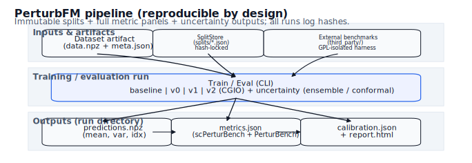
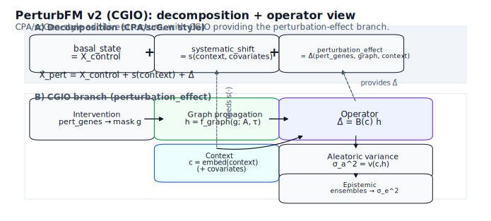

# PerturbFM

Perturbation response prediction with **immutable OOD splits**, **full metric panels**, and **calibrated uncertainty**.

This repo is deliberately opinionated: it tries to make “fake wins” hard by baking evaluation rigor into the tooling.

- Architecture + hard rules: `project_overview.md`
- Literature + competitive positioning + v2 direction: `current_state.md`

## What’s in the repo right now

Core pieces (working):
- Canonical dataset object: `PerturbDataset` (+ artifact I/O).
- Split system: frozen, hash‑locked splits stored under `splits/`.
- CLI: `perturbfm data`, `perturbfm splits`, `perturbfm train`, `perturbfm eval`.
- Models:
  - Baselines (mean delta, ridge delta)
  - PerturbFM v0 (probabilistic)
  - PerturbFM v1 (graph + gating)
  - PerturbFM v2 (CGIO: graph‑propagated intervention + contextual operator)
- Evaluation:
  - scPerturBench-style metric panel (implemented)
  - PerturBench-style metric panel (implemented)
  - Uncertainty outputs + basic conformal intervals (optional)
- Scripts:
  - `scripts/check.sh` (quick repo health)
  - `scripts/validate_metrics.py` (metric parity harness)
  - `scripts/run_ablations.py` (batch runs + summary)
  - `scripts/generate_pub_diagrams.py` (regenerate README diagrams)

Known gaps / “not done yet”:
- Real benchmarks:
  - `PerturBenchAdapter` supports artifacts and `.h5ad` (requires `anndata`), but importing *official* PerturBench splits depends on you having the benchmark repo/files locally.
  - `scPerturBenchAdapter` is intentionally external-only (GPL isolation).
- Metric definitions still need **numerical parity validation** against official reference scripts in `third_party/` (use `scripts/validate_metrics.py`).
- Training control/reporting:
  - early stopping on an OOD validation metric is still TODO
  - `report.html` is intentionally simple (tables + raw JSON)

## Big picture (pipeline)



If you can’t see the image above for some reason, read it as:

`data artifact -> frozen split -> train -> predictions -> metrics+calibration -> report`

## Models (at a glance)

- **Baselines**
  - `global_mean`, `per_perturbation_mean`, `per_perturbation_context_mean`
  - `ridge` (predict delta from control expression)
- **PerturbFM v0**
  - simple probabilistic model in delta space (mean + per-gene variance)
  - inputs: control expression + learned perturbation/context embeddings
- **PerturbFM v1**
  - graph-augmented perturbation encoder + trust gating
  - intended for multi-gene perturbations when you have a gene graph
- **PerturbFM v2 (CGIO)**
  - intervention is a **gene set** (`obs["pert_genes"]`)
  - propagate intervention over one or more graphs (with gating)
  - predict delta via a **context-conditioned low-rank operator**

CGIO sketch:



If you can’t see the image above for some reason, read it as:

`pert_genes -> pert_mask -> graph propagation (+ context) -> contextual operator -> delta mean/var`

## Repository layout

- `src/perturbfm/`: package code
  - `data/`: dataset abstraction, adapters, splits
  - `models/`: baselines + PerturbFM models
  - `train/`: training helpers
  - `eval/`: metrics, evaluator, report
  - `utils/`: hashing, logging, seeding
- `scripts/`: placeholder helpers for external benchmarks
- `tests/`: unit + smoke tests
- `runs/`: run artifacts (gitignored)
- `third_party/`: external benchmarks (gitignored)
- `splits/`: versioned split artifacts (tracked)

## Dataset artifact schema

Each dataset artifact directory contains:
- `data.npz` with keys:
  - `X_control`, `X_pert`, `delta` (float32, shape `[N, G]`)
  - `obs_idx` (int64, shape `[N]`)
- `meta.json` with keys:
  - `obs` (table-like dict; must include `pert_id`, `context_id`, `batch_id`, `is_control`)
  - `var` (gene identifiers list)
  - `metadata` (freeform dict)

Common `obs` fields you’ll see in practice:
- `pert_id`: `"control"` or a perturbation ID (single or combo string)
- `context_id`: cell type / cell line / condition grouping
- `batch_id`: batch identifier
- `is_control`: boolean
- `pert_genes`: (v2 CGIO) list of perturbed gene IDs per row (empty list for controls)
- `covariates`: optional dict of arrays (dose/time/etc.)

## Graph format + gating modes (v1/v2)

Graph files should be sparse‑friendly and aligned to `var` order:

- `graphs/<name>.npz`
  - `adjacency`: float32 `[G, G]` (dense allowed for small graphs; converted to sparse internally)
  - `genes`: list of length `G` matching `var`

Gating modes (for graph trust):
- `none` — no gating
- `scalar` — single global gate
- `node` — per‑node gate
- `lowrank` — low‑rank edge gating (U,V embeddings)
- `mlp` — edge gating via small MLP over node embeddings

## Split system

Splits are immutable and hash‑locked:
- Stored as JSON files under `splits/` (filename is the split hash).
- Every run records the split hash (`split_hash.txt` + `config.json`).
- Training/eval should never “silently regenerate” a split.

You can override the split store location with `PERTURBFM_SPLIT_DIR` (used in tests).

## Run artifacts

Each run writes:
- `config.json`
- `split_hash.txt`
- `predictions.npz` (`mean`, `var`, `idx`)
- `metrics.json`
- `calibration.json`
- `report.html`

### Metrics and calibration outputs

`metrics.json` is a single combined object that always includes:

- `scperturbench`
  - `global`: metric name → value
  - `per_perturbation`: perturbation → metrics
  - `per_context`: context → metrics
- `perturbench`
  - same structure as above
- `uncertainty`
  - `coverage`: `{0.5, 0.8, 0.9, 0.95}` → empirical coverage
  - `nll`: Gaussian NLL in delta space
  - `risk_coverage`: arrays of risk vs coverage points
  - `ood_auroc`: AUROC if `ood_labels` are provided
  - `conformal`: optional conformal interval stats (when enabled)

`calibration.json` currently mirrors the `uncertainty` panel (so you can load it without parsing the full `metrics.json`).

### Run IDs and hashes

Runs are stored under `runs/<run_id>/` (gitignored). The run id is designed to be sortable and traceable:

- `<UTCYYYYMMDD-HHMMSS>_<splitHash7>_<modelName>_<configHash>`

`config.json` also stores:
- `data_hash` (hash of the dataset artifact metadata)
- `split_hash`
- `config_hash`

## CLI quickstart (synthetic)

This is the fastest way to sanity-check the full pipeline.

```bash
python -m pip install -e .

perturbfm data make-synth --out /tmp/pfm_synth
perturbfm splits create --data /tmp/pfm_synth --spec context_ood --holdout-context C0
perturbfm train baseline --data /tmp/pfm_synth --split <HASH> --baseline global_mean
```

Train the v2 CGIO model on the same synthetic artifact:

```bash
perturbfm train perturbfm-v2 --data /tmp/pfm_synth --split <HASH> --epochs 5
```

Evaluate existing predictions:

```bash
perturbfm eval predictions --data /tmp/pfm_synth --split <HASH> --preds /path/to/predictions.npz --out /tmp/pfm_eval
```

## Ablations (batch runs)

Create a small JSON list of configs (example):

```json
[
  {"kind": "baseline", "name": "global_mean"},
  {"kind": "v0", "epochs": 2, "hidden_dim": 16},
  {"kind": "v2", "epochs": 2, "hidden_dim": 16, "use_gating": true, "contextual_operator": true}
]
```

Then run:

```bash
python scripts/run_ablations.py --data /tmp/pfm_synth --split <HASH> --configs configs.json --out runs_summary.json
```

## Testing

```bash
pytest -q
```

If `pytest` crashes in your environment due to SSL/plugin loading issues (e.g., `ImportError: libssl.so.1.1`), try:

```bash
PYTEST_DISABLE_PLUGIN_AUTOLOAD=1 pytest -q
```

Quick health check:

```bash
scripts/check.sh
```

## Metric validation (important)

Even though the metric functions are implemented, you should validate them against official reference scripts before making claims:

```bash
python scripts/validate_metrics.py --data /tmp/pfm_synth --preds /path/to/predictions.npz
```

If you have the official benchmark repos cloned under `third_party/`, wire their reference scripts into `scripts/validate_metrics.py` and compare outputs numerically.

## External benchmarks (GPL isolation)

This repo does **not** vendor benchmark code. The intent is:

- Keep PerturbFM core permissively licensed.
- Treat scPerturBench (GPL) as an *external evaluation harness* only.

Typical workflow:
- Clone benchmarks into `third_party/` (gitignored).
- Run their scripts from `scripts/validate_metrics.py` / shell scripts without copying code into `src/perturbfm/`.
- If you need `.h5ad` loaders, install extras: `pip install -e ".[bench]"`.

Export predictions for external harnesses:

```bash
python scripts/export_predictions.py --preds runs/<run_id>/predictions.npz --out /tmp/preds --data /path/to/artifact
```

## Roadmap (next)

1) Validate metric implementations numerically against official benchmark scripts (executed from `third_party/`, without vendoring GPL code).
2) Implement real benchmark adapters + official split import/export (PerturBench first).
3) Tighten training control/reporting (OOD-metric early stopping, richer reports) and run the full v0/v1/v2 ablation grid on strict OOD splits.
